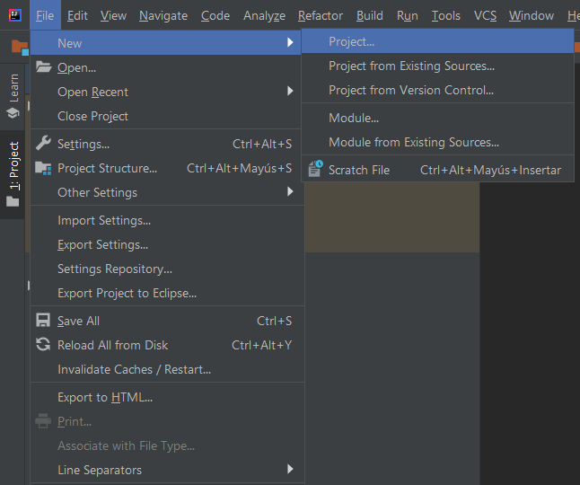
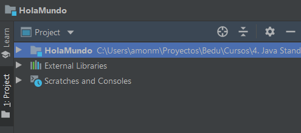
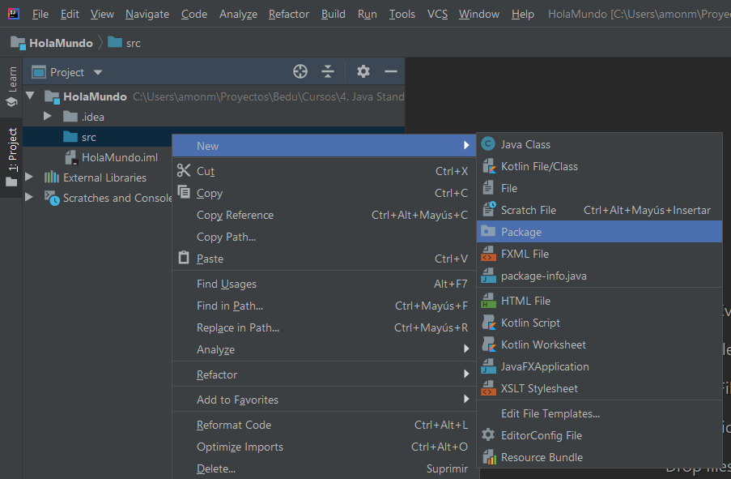
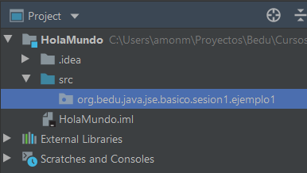
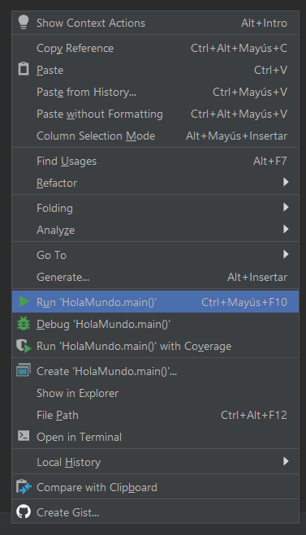

## Ejemplo 01: Hola mundo con ItelliJ IDEA

### OBJETIVO

- Aprender cómo crear un nuevo proyecto desde el IDE.
- Aprender la sintaxis básica de una aplicación Java.
- Aprender a ejecutar una aplicación desde el IDE

#### REQUISITOS

1. Tener instalada la última versión del JDK 8.
2. Tener instalada la última versión de IntelliJ IDEA Community

#### DESARROLLO

Agrega las instrucciones generales del ejemplo o reto

1. Abre tu IDE, IntelliJ IDEA, y en el menú `File` selecciona la opción `New -> Project...`.



2. En la opción de **Project SDK** asegúrate de tener seleccionada la versión 1.8 (o superior). No selecciones ninguna librería ni framework adicional.


3. En la siguiente ventana, NO selecciones la opción para crear un nuevo proyecto dewsde un template; crearemos todos los elementos necesarios a mano en los siguientes pasos.


4. Dale un nombre al proyecto, es tradición en la programación que el primer proyecto con el que estamos aprendiendo a usar un nuevo lenguaje o herramienta se llame **Hola Mundo**.


5. Presiona el botón `Finish` y con esto tu nuevo proyecto deberá aprecer en el panel `Project`, ubicado a la izquierda del IDE:



6. Expande el proyecto *HolaMundo* y en la carpeta llamada `src`, haz clic derecho y selecciona `New -> Package`. Recuerda que un paquete nos permite agrupar los elementos de nuestra aplicación para tenerlos de una forma ordenada.



7. Como nombre del paquete escribe: 
		
		org.bedu.java.jse.basico.sesion1.ejemplo1
		



8. En el nuevo paquete que acabas de crear, haz clic derecho y selecciona la opción `New -> Java Class`.


9. En la ventana emergente, asegúrate de que esté seleccionada la opción `Class` y escribe **HolaMundo** como nombre de la clase.


10. Tu nueva clase aparecerá en el editor de código del IDE:


11. El método ***main*** es el punto de entrada en toda aplicación Java, por lo que debemos escribir uno para poder colocar adentro nuestro código y que este sea ejecutado por la computadora. El método main tiene una *firma* estándar y prácticamente siempre es la misma. Adentro de la clase **HolaMundo** escribe:

```java
public static void main(String[] args) {
        
}
```


12. Con esto, lo único que nos falta es escribir el código que se ejecutará. En este caso será la salida en consola de el texto `Hola Mundo`. Para esto escribimos el siguiente código dentro del método *main*:

```java
System.out.println("Hola Mundo!!");
```

el archivo completo debe tener el siguiente contenido:
```java
public class HolaMundo {
    public static void main(String[] args) {
        System.out.println("¡¡Hola Mundo!!");
    }
}
```

13. El último paso es ejecutar la aplicación. Para esto, la forma más sencilla es hacer clic derecho en el editor de código, con lo que aparecerá un menú; en este menú seleccionamos la opción `Run 'HolaMundo.main()'`:
.

Esto debemos hacerlo solo la primera vez, posteriormente ya podremos ejecutar la aplicación con el botón Run que aparece en la parte superior derecha del editor.


14. Si no hay errores en el código, se abrirá el panel de ejecución, en el cual deberemos ver el texto `¡¡Hola Mundo!!`


¡¡Felicidades!! acabas de crear tu primera aplicación en Java.


