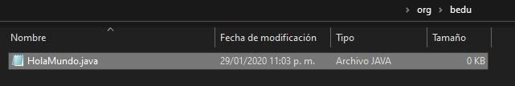

## Ejemplo 02: Hola mundo desde la línea de comandos

### OBJETIVO

- Aprender a compilar un archivo `.java` desde la línea de comandos, sin necesidad de usar un IDE.
- Aprender a ejecutar una aplicación desde la línea de comandos.
- Aprender a recibir parámetros en una aplicación creada usando la línea de comandos.

#### REQUISITOS

1. Tener instalado el JDK 8 o superior.
2. Tener acceso a una teminal o línea de comandos.
3. Tener acceso a un editor de textos planos (como `notepad`o `nano`).

#### DESARROLLO
1. En Java usamos los paquetes para organizar y agrupar las clases. Como en este ejemplo no usaremos un IDE lo haremos a mano. Un paquete se representa como una carpeta o directorio en el sistema de archivos del sistema operativo que usamos, por lo tanto, para crear un paquete hay que crear una carpeta. 

En un directorio vacío de tu computadora crea una nueva carpeta llamada `org` y dentro de esta otra llamada `bedu`. Para no complicar el ejemplo, usaremos sólo estas dos carpetas.

2. Dentro de la carpeta `bedu` crea un nuevo archivo llamado HolaMundo.java.




3. Dentro de este archivo coloca, como primera línea, lo siguiente:

		package org.bedu;

Esta sentencia le indica al compilador de Java que la clase que contendrá este archivo se encuentra en el paquete `org.bedu`.

4. Lo siguiente es declarar la clase HolaMundo como una clase pública. Por regla general, un archivo .java sólo puede tener una clase pública y el archivo debe tener el mismo nombre que esta clase. Como el archivo se llama `HolaMundo`, la clase que crearemos también tendrá este nombre:

```java
public class HolaMundo{

}
```

5. Dentro de esta clase, declararemos el método `main`. Recuerda que la firma de este método es estándar:

```java
public static void main(String[] args){
  
}
```
6. Ahora, dentro del método `main` colocaremos la instrucción que nos permite imprimir texto en pantalla; más adelante entraremos en detalles de cómo funciona, por ahora es suficiente con saber que la instrucción es:

		System.out.println("!!Hola Mundo¡¡");
		
7. El contenido completo del archivo `HolaMundo.java` debe ser el siguiente:

```java
package org.bedu;

public class HolaMundo{
  public static void main(String[] args){
    System.out.println("!!Hola Mundo¡¡");
  }
}
```
