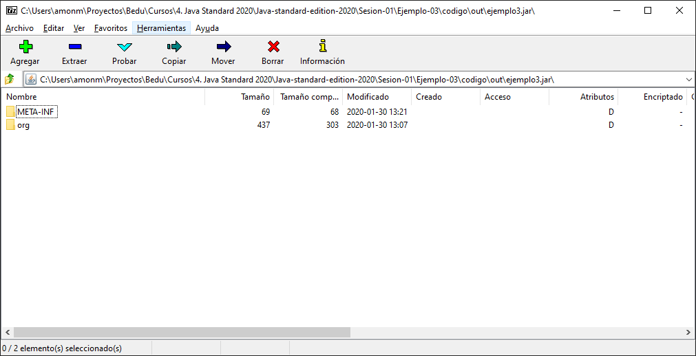

## Ejemplo 03: Creación de archivo Jar

### OBJETIVO

- Aprender a empaquetar la aplicación en un archivo **.jar** para su distribución.

#### REQUISITOS

1. Tener instalado el JDK 8 o superior.
2. Tener acceso a una terminal o línea de comandos.
3. Tener agregada en la variable PATH la ruta de la herramienta `jar`.

#### DESARROLLO

Un jar, o Java ARchive, es un archivo que nos permite agrupar las clases que conforman nuestra aplicación, junto con alguos metadatos que permiten que este se ejecute como cualquier otra aplicación de nuestra computadora. Un jar es una forma especial de zip, que la JVM puede interpretar para ejecutar nuestra aplicación.

En este ejemplo vamos a empaquetar nuestra aplicación en un jar para poder ejecutarlo de una forma más sencilla. 

1. Tomamos el código de cualqiera de los ejemplos, en este caso usaremos como base el Ejemplo 2, en el que realizamos la compilación de las clases de la aplicación desde la línea de comandos. Para poder crear el jar debemos abrir una terminal y situarnos adetro del directorio `out`, que contiene las clases que se generaron.

2. Una vez dentro del directorio `out`, ejecutamos el siguiente comando:

		jar cf ejemplo3.jar .
		
En donde:

* **jar** es el nombre de la herramienta que usamos para generar estos archivos.
* **c** indica que se quiere crear un archivo JAR.
* **f** indica que se quiere que la salida sea a un archivo en vez de a la salida estándar (la consola).
* **ejemplo3.jar** es el nombre de archivo que se generará.
* **.** el último argumento indica qué archivos serán incluidos en el jar; el punto indica que se incluirán todas las carpetas y archivos que están en donde nos encontramos.

al ejecutar el comando podemos ver que se ha creado el archivo jar correspondiente.

Si abres el archivo podrás ver la siguiente estructura:

en donde están nuestra clase (**HolaMundo.class**) junto con un archivo de meta información (**META-INF**).

3. Ejecuta ahora la aplicación desde este archivo jar. Para eso, debes usar el siguiente comando:

	java -cp ejemplo3.jar org.bedu.HolaMundo
	
Con el que le indicamos al comando `java` que debe buscar la clase **HolaMundo** dentro del archivo **ejemplo3.jar** y ejecutar la clase **org.bedu.HolaMundo**.
