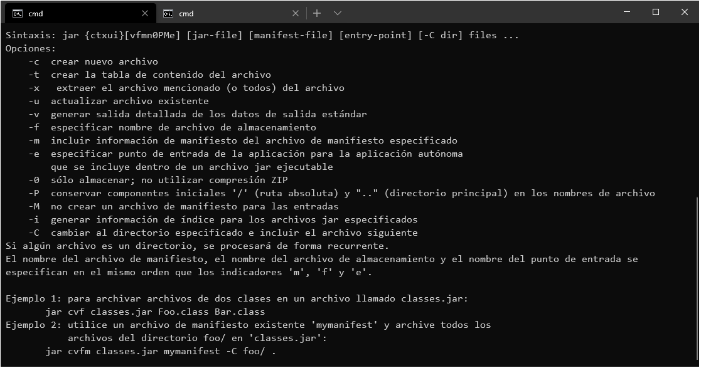

## Reto 03: Creación de archivo JAR auto-ejecutable

### OBJETIVO 

- Crear un jar desde la línea de comandos, para distribuir una aplicación. 
- Hacer que el jar identifique cuál es la clase principal, y en automático la ejecute.

#### REQUISITOS 

1. Tener instalado el JDK 8 o superior.
2. Tener acceso a una terminal o línea de comando.
3. Tener un proyecto creado, como el del Ejemplo 02.
4. Tener agregada en la variable PATH la ruta de las herramientas `jar`y `java`.

#### DESARROLLO

- Realiza las modificaciones necesarias en la generación del archivo jar del Ejemplo 03 para que este pueda ejecutarse sin necesidad de indicarle cuál es la clase principal.

- **Tip #1**: Es necesario hacer algunas modificaciones en el archivo **MANIFEST.MF** que se genera dentro del jar.

	
Solución

Como el archivo **MANIFEST.MF** se genera de forma automática al momento de crear el jar, no es buena idea modificarlo después de que el jar está creado, por esto mismo es mejor usar las opciones proporcionadas por la herramienta jar para modificar la generación de este archivo.

1. En una terminal o consola, ejecuta el comando `jar` para ver las opciones que este tiene disponibles.

2. En las opciones aparece `-e`, revisa la descripción de esta, ya que será la opción que nos ayude a iniciar cuál es la clase principal de la aplicación.

3. Dentro del directorio **out** ejecuta el siguiente comando:

		jar cfe reto03.jar org.bedu.HolaMundo .
		
Con el cual indicaremos que crearemos un nuevo JAR con el nombre de **reto03.jar**, que el punto de entrada (la clase principal) es **org.bedu.HolaMundo** y que debe colocar dentro de este todas las carpetas y clases del directorio actual (`out`).

No debe haber ninguna salida en la consola, pero si abres el archivo **MANIFEST.MF** del jar generado, debe contener la siguiente línea:

		Main-Class: org.bedu.HolaMundo

4. Desde la misma línea de comandos ejecuta la aplicación. Nuevamente debes usar la herramienta `java` pero con otras opciones:

		java -jar reto03.jar
		
Revisa la salida en la consola, ¿es lo que esperabas?

 
