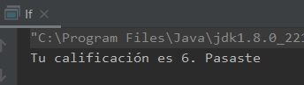

## Reto 02: Uso de if

### OBJETIVO 

- Reforzar el conocimiento adquirido sobre el uso de la setencia **if**

#### REQUISITOS 

1. Haber concluido el ejemplo 02.
2. Tener instalada la última versión del JDK 8.
3. Tener instalada la última versión de IntelliJ IDEA Community


#### DESARROLLO

Modifica el código del Ejemplo 2 para obtener el mismo funcionamiento, pero usando sentencias **if** en vez de **switch**.

<details>
	<summary>Solución</summary>
	
1. En el IDE IntelliJ IDEA, crea un nuevo proyecto llamado **If**.

2. Dentro del proyecto crea un nuevo paquete llamado **org.bedu.java.jse.basico.sesion2.reto2**.

3. Dentro del paquete anterior crea una nueva clase llamada **If** y dentro de esta un método **main**.

4. Recuerda que para la primera perte debemos cumplir con las siguientes condiciones, dependiendo de la calificación:
    * Si la calificación es igual a 10 el mensaje debe ser: **¡Excelente!**.
    * Si la calificación es 9 u 8 el mensaje debe ser: **¡Muy bien!**.
    * Si la calificación es 7 el mensaje debe ser: **Bien hecho**.
    * Si la calificación es 6 el mensaje debe ser: **Pasaste**.
    * Si la calificación es menor a 5 el mensaje debe ser: **Mejor vuelve a intentarlo**.

5. Primero, declara una variable de tipo **String** que almacenará el mensaje que se mostrará.

```java
String mensaje;
```

6. Después, una variable que será en la que escribirás la calificación, la cual en este momento no tendrá ningún valor, como la calificación sólo tendrá valores entre 0 y 10 usa una variable de tipo byte:

```java
byte calificacion;
```

7. Agrega la instrucción **if**. En este caso la variable cuyo valor probarás será **calificacion**, inicia probando el valor de **10**:

```java
if(calificacion == 10){
	mensaje = "¡Excelente!";
}
```

8. A continuación, usa una instrucción **else if** para los valores **9** y **8**. Como ambas calificaciones muestran el mismo valor, puedes usar el operador or (**||**) para indicar que **calificacion** puede tener cualquiera de los dos valores:

```java
else if (calificacion == 9 || calificacion == 8){
	mensaje = "¡Muy bien!";
}
```
9. Para los valores de **7** y **6** puedes hacer una validación sencilla, cada uno en su propia sentencia **else if**:
```java
else if(calificacion == 7){
	mensaje = "Bien hecho";
} else if (calificacion == 6){
	mensaje = "Pasaste";
}
```

10. Finalmente, para la última condición puedes usar una sentencia **else**, de la siguiente forma:

```java
else {
	mensaje = "Mejor vuelve a intentarlo";
}
```

El código debe verse más o menos de la siguiente forma:
```java
        if(calificacion == 10){
            mensaje = "¡Excelente!";
        } else if (calificacion == 9 || calificacion == 8){
            mensaje = "¡Muy bien!";
        } else if(calificacion == 7){
            mensaje = "Bien hecho";
        } else if (calificacion == 6){
            mensaje = "Pasaste";
        } else {
            mensaje = "Mejor vuelve a intentarlo";
        }
```

11. Ahora, muestra un mensaje que  diga cuál es la calificación y el mensaje al alumno, de la siguiente forma:

```java
	System.out.println("Tu calificación es " + calificacion + ". " + mensaje);
```

12. Da un valor a **calificacion** y comprueba que la salida es correcta.



</details> 


