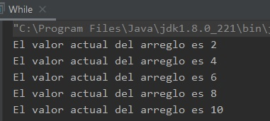

## Reto 03: Uso de while

### OBJETIVO 

- Practicar el uso de la sentencia **while**.

#### REQUISITOS 

1. Haber completado el Ejemplo3.
2. Tener instalada la última versión del JDK 8.
3. Tener instalada la última versión de IntelliJ IDEA Community.

#### DESARROLLO

Realiza las modificaciones necesarias del ejemplo 3, para que funcione con **while** en vez de **for**.

<details>
	<summary>Solución</summary>
	
1. En el IDE IntelliJ IDEA, crea un nuevo proyecto llamado **While**.

2. Dentro del proyecto crea un nuevo paquete llamado **org.bedu.java.jse.basico.sesion2.reto3**.

3. Dentro del paquete anterior crea una nueva clase llamada **While** y dentro de esta un método **main**.

4. Dentro del método **main** inicia creando un ciclo para imprimir en consola los valores de 1 al 10. Recuerda que en el caso de **while**, la variable que se usa como índice debe declararse e inicializarse afuera del ciclo.

Esta variable podemos incrementarla dentro del ciclo, en la condición, de la siguiente forma:

```java
 	short i = 0;

        while (++i <= 10) {
            System.out.println("El valor de i es " + i);
        }
```
5. Ejecuta el código de la aplicación, con lo que debes obtener la siguiente salida:

		El valor de i es 1
		El valor de i es 2
		El valor de i es 3
		El valor de i es 4
		El valor de i es 5
		El valor de i es 6
		El valor de i es 7
		El valor de i es 8
		El valor de i es 9
		El valor de i es 10

Nota que como estás incrementando el valor de **i** en la condición, debes inicializar su valor en **0**. Si quieres cambiar esto, puedes usar un ciclo **do...while***, de la siguiente forma:

```java
	short i = 1;

        do {
            System.out.println("El valor de i es " + i);
        } while (i++ < 10);
```


6. Ahora, para la segunda parte deberás tomar los valores desde un arreglo. Primero, declara el arreglo de valores de la siguiente forma:

```java
short[] valores = {1, 2, 3, 4, 5, 6, 7, 8, 9, 10};	
```

7. Recuerda que los arreglos tienen su primer valor en la posición 0, por lo que el índice que uses debe comenzar en este número. Los arreglos contienen un atributo length que indica el número de elementos dentro del arreglo; también, recuerda que cuando se usa el ciclo **while**, la variable que sirve como índice debe declararse e inicializarse fuera del ciclo:

```java
        short i = 0;

        while(i < valores.length){
            System.out.println("El valor actual del arreglo es " + valores[i++]);
        }
```
Nota como en esta ocasión, el incremento del valor **i** se ha movido hasta el momento que hacemos la lectura del valor en el arreglo, y no dentro de la condición. Si lo haces de otra manera, el incremento no se hará de la forma correcta y corres el riesgo de que ocurra un error.
 
8. Para terminar, realiza las modificaciones para solo imprimir los valores pares dentro del arreglo. En este caso del valor de **i** debe inicializarse en **1** y no en 0. Además, el incremento de valor debe realizarse como el último paso dentro del ciclo, para evitar un error al momento de hacer la lectura, de la siguiente forma:

```java
	short i = 1;
        while(i <= valores.length){
            System.out.println("El valor actual del arreglo es " + valores[i]);
            i += 2;
        }
```
	
Con esto, debes obtener la siguiente salida en la consola:



</details> 


