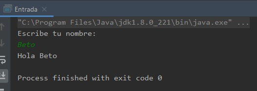

## Ejemplo 03: Lectura desde el teclado con Scanner y Console.

### OBJETIVO

- Aprender distintas formas en las que podemos leer información desde el teclado, para que el usuario interctúe con nuestra aplicación.

#### REQUISITOS

1. Tener instalada la última versión del JDK 8.
2. Tener instalada la última versión de IntelliJ IDEA Community


#### DESARROLLO

1. En el IDE IntelliJ IDEA, crea un nuevo proyecto llamado **Entrada**.

2. Dentro del proyecto crea un nuevo paquete llamado **org.bedu.java.jse.basico.sesion3.ejemplo1**.

3. Dentro del paquete anterior crea una nueva clase llamada **Entrada** y dentro de esta un método **main**.

4. Dentro del método main iniciaremos creando una nueva instancia de la clase **Scanner**, de esta forma:

```java
        Scanner scanner = new Scanner(System.in);
```

**Nota**: No olvides que además de crear la instancia anterior, se debe importar la clase con la instrucción **import java.util.Scanner;**. IntelliJ IDEA hará esto en automático.

5. Ahora colocaremos un mensaje que indique que debemos escribir nuestro nombre. Esto nos ayudará a saber que la aplicación nos está pidiendo interacutar con ella:

```java
	System.out.println("Escribe tu nombre: ");
```

6. Ahora, leeremos la entrada del teclado usando el método **nextLine()** de la clase **Scanner**. Este método lee lo que escribamos, y termina de leer en el momento que presionamos la tecla *Enter*, de esta forma es como le indicamos que hemos terminado de escribir. El valor leído lo almacenamos en la variable **nombre**, la cual será de tipo **String**:

```java
	String nombre = scanner.nextLine();
```

7. Finalmente, una vez que hemos obtenido el valor, lo imprimimos nuevamente:

```java
	System.out.println("Hola " + nombre);
```

8. Ejecutamos la aplicación, y en la consola de IntelliJ IDEA veremos el mensaje solicitando nuestro nombre, en ese momento debemos escribir en la misma consola el valor y terminar la entrada con la tecla *Enter*. Debemos tener una salida similar a la siguiente:




