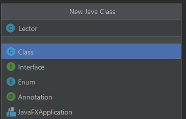

## Ejemplo 02: Clase propia

### OBJETIVO

- Aprender los elementos básicos de la declaración de una clase propia.
- Aplicar la creación de métodos que regresen valores booleanos, numéricos y Strings.

#### REQUISITOS

1. Tener instalada la última versión del JDK 8.
2. Tener instalada la última versión de IntelliJ IDEA Community


#### DESARROLLO

Usando una lógica similar a la del reto 1, crear una clase que indique cuántas vocales, consonantes, números y símbolos hay en una cadena ingresada por el usuario.

1. En el IDE IntelliJ IDEA, crea un nuevo proyecto llamado **Letras**.

2. Dentro del proyecto crea un nuevo paquete llamado **org.bedu.java.jse.basico.sesion3.ejemplo2**.

3. Dentro del paquete anterior crea una nueva clase llamada **Letras** y dentro de esta un método **main**. Esta clase será el punto de entrada de la aplicación, pero no en la que se ejecute la lógica principal de la aplicación.

4. Crea, también dentro del paquete, una nueva clase llamada **Lector** esta clase será la encargada de manejar la lectura de datos por parte del usuario. Inicialmente será un envoltorio para la clase **Scanner**, pero esto nos dará flexibilidad si más adelante decidimos usar alguna clase distinta para hacer dicha lectura. 

5. Dentro de la clase lector, comencemos declarando e instanciando un *atributo* de tipo **Scanner**:

```java
	private Scanner scanner = new Scanner(System.in);
```

6. Después, declaremos un *método* llamado **muestraMensaje** que recibirá como parámetro el mensaje a mostrar, como una variable de tipo **String** y no regresará ningún valor (**void**). Este método también nos sirve para encapsular la forma en la imprimimos este mensaje:

```java
	public void muestraMensaje(String mensaje){
        	System.out.print(mensaje);
    	}
```

7. Ahora, declaramos un método llamado **leeEntrada**, que no recibirá parámetros y regresará una **String**. Este método usará la instancia de **Scanner** para leer el texto ingresado por el usuario y regresarlo posteriormente:

```java
	public String leeEntrada(){
        	return scanner.nextLine();
    	}
```

con esto, terminamos la clase **Lector**.

8. Ahora, creamos una nueva clase llamada **ContadorCaracteres**. Esta clase será quien realice el conteo de cada uno de los tipos que definimos al inicio del ejemplo. Dentro de esta clase crearemos dos tipos de métodos, los primeros se encargarán de recibir un parámetro de tipo **char** y determinar si es de un tipo determinado; el segundo grupo realizará el conteo de los los caracteres dentro de la palabra que pertenecen a dicho grupo. Comencemos con el método que determinará si el caracter recibido es una vocal:
```java
    public boolean isVocal(char caracter){
        return (caracter == 'a' || caracter == 'e' || caracter == 'i' || caracter == 'o' || caracter == 'u');
    }
```

9. El siguiente método determinará si el caracter recibido es un número. Para poder hacer esto, nos apoyaremos de el valor *ascii* del caracter. Si revisamos en la tabla ASCII (http://www.asciitable.com/), podemos ver que el valor ascii del **0** es *48*, el del **1** es *49*, el del **2** es *50*, etc., hastá llegar a que el valor del número **9** es *57*. Por lo tanto, la validación pude quedar de la siguiente forma, en la que realizamos el casteo del caracter a un número de tipo **short** y verificamos si su valor ascii está entre el 48 y el 57; de ser así, podemos saber que el caracter es un número:

```java
    public boolean isNumero(char caracter){
        short codigoAscii = (short)caracter;
        return codigoAscii >= 48 && codigoAscii <= 57;
    }
```
10. Para saber si se trata de una consonante, podemos hacer algo parecido al caso anterior. Lo primero será convertir el caracter a un **short** y revisar el valor de este `short`, si el valor está entre el *97* (**a**) y el *122* (**z**) y además NO es una vocal, podemos saber que se trata de una consonante. 

```java
    public boolean isConsonante(char caracter){
        short codigoAscii = (short)caracter;
        return (codigoAscii >= 97 && codigoAscii <= 122) && !isVocal(caracter);
    }
```
11. Finalmete, crearemos el método que determinará si el caracter se trata de un símbolo. Este será el método más sencillo de todos, ya que podemos determinar que si el caracter no es un número, vocal o consonante, se trata de un símbolo. Además, ya tenemos forma de determinar si se trata de alguno de los tipos anteriores:

```java
    public boolean isSimbolo(char caracter){
        return !(isVocal(caracter) || isNumero(caracter) || isConsonante(caracter));
    }
```



