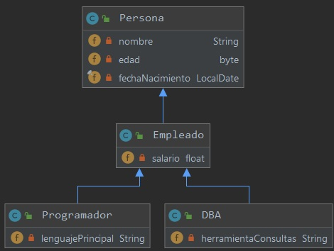
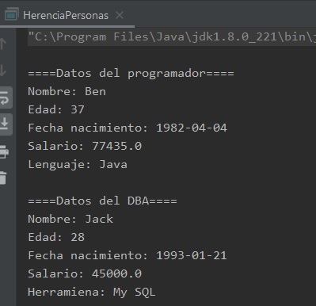

## Reto 2: Herencia de personas.

### OBJETIVO 

- Aplicar la herencia en jeraquías más complejas de objetos.

#### REQUISITOS 

1. Tener instalada la última versión del JDK 8.
2. Tener instalada la última versión de IntelliJ IDEA Community.


#### DESARROLLO

En este reto, crearás una jerarquía de 4 clases, de acuerdo con el siguiente diagrama.



- En la clase **Persona**, el campo **fechaNacimiento** debe ser **final**.
- Todos los métodos de todas las clases deben ser privados.
- Al final deberás probar el funcioamiento de tu aplicación, creando una instancia de **Programador** y una instancia de **DBA** y mostrando todas las propiedades de su árbol de jeraquías hasta la calse **Persona**. 

<details>
	<summary>Solución</summary>
	
1. En el IDE IntelliJ IDEA, crea un nuevo proyecto llamado **HerenciaPersonas**.

2. Dentro del proyecto crea un nuevo paquete llamado **org.bedu.java.jse.basico.sesion5.reto2**.

3. Dentro del paquete anterior crea una nueva clase llamada **HerenciaPersonas** y dentro de esta un método **main**.

4. Crea una primera clase **Persona** con los siguientes atributos, junto con sus correspondientes **getters** y **setters**. Recuerda que **fechaNacimiento** debe ser `final`, y por lo tanto no se proporcionará un *setter* para este atributo:

```java
public class Persona {
    private String nombre;
    private byte edad;
    private final LocalDate fechaNacimiento;
}
```

5. Agrega un constructor que reciba como parámetros todos los campos de `Persona`:

```java
    public Persona(String nombre, byte edad, LocalDate fechaNacimiento) {
        this.nombre = nombre;
        this.edad = edad;
        this.fechaNacimiento = fechaNacimiento;
    }
```

6. Ahora, crea una clase **Empleado** que extienda de **Persona** y tenga el atributo de **salario**, con sus correspondientes *getters* y *setters*:

```java
public class Empleado extends Persona {
    private float salario;
}
```

7. Crea un constructor que reciba todos los atributos de **Persona** y **Empleado**, y establezca los valores de las variables correspondientes:

```java
    public Empleado(String nombre, byte edad, LocalDate fechaNacimiento, float salario) {
        super(nombre, edad, fechaNacimiento);
        this.salario = salario;
    }
```

8. Crea una clase **Programador** que extienda de **Empleado** y tenga **lenguajePrincipal** como atributo, junto con sus correspondientes *getters*, *setters* y *constructor*.

```java
public class Programador extends Empleado {
    private String lenguajePrincipal;

    public Programador(String nombre, byte edad, LocalDate fechaNacimiento, float salario, String lenguajePrincipal) {
        super(nombre, edad, fechaNacimiento, salario);
        this.lenguajePrincipal = lenguajePrincipal;
    }
}
```

9. Para terminar con la jerarquía de clases, crea una clase **DBA** que extienda de **Empleado** y tenga **herramientaConsultas** como atributo, junto con sus correspondientes *getters*, *setters* y *constructor*.

```java
public class DBA extends Empleado {
    private String herramientaConsultas;

    public DBA(String nombre, byte edad, LocalDate fechaNacimiento, float salario, String herramientaConsultas) {
        super(nombre, edad, fechaNacimiento, salario);
        this.herramientaConsultas = herramientaConsultas;
    }
}
```

10. Ahora, en el método **main** crea una instancia de **Programador** y una instancia de **DBA** de inicializalas con los valores de tu preferencia.

```java
        Programador p = new Programador("Ben", (byte)37, LocalDate.of(1982, Month.APRIL, 4), 77435F, "Java");
        DBA d = new DBA("Jack", (byte)28, LocalDate.of(1993, Month.JANUARY, 21), 45000F, "My SQL");
```

11. Para terminar, imprime todos los valores de cada uno de los objetos para comprobar que los valores se establecieron de la forma correcta:

```java
        System.out.println("\n====Datos del programador====");

        System.out.println("Nombre: " + p.getNombre());
        System.out.println("Edad: " + p.getEdad());
        System.out.println("Fecha nacimiento: " + p.getFechaNacimiento());
        System.out.println("Salario: " + p.getSalario());
        System.out.println("Lenguaje: " + p.getLenguajePrincipal());

        System.out.println("\n====Datos del DBA====");
        System.out.println("Nombre: " + d.getNombre());
        System.out.println("Edad: " + d.getEdad());
        System.out.println("Fecha nacimiento: " + d.getFechaNacimiento());
        System.out.println("Salario: " + d.getSalario());
        System.out.println("Herramiena: " + d.getHerramientaConsultas());
```




</details> 


