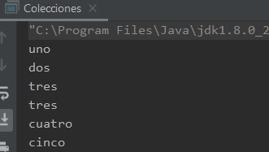

## Ejemplo 03: Uso de colecciones

### OBJETIVO

- Aprender a usar las colecciones `List` y `Set` para agregar y obtener elementos de tipos integrados en Java y de tipos propios.
- Aprender la relación del método `equals` y las colecciones.

#### REQUISITOS

1. Tener instalada la última versión del JDK 8.
2. Tener instalada la última versión de IntelliJ IDEA Community.


#### DESARROLLO

1. En el IDE IntelliJ IDEA, crea un nuevo proyecto llamado **Colecciones**.

2. Dentro del proyecto crea un nuevo paquete llamado **org.bedu.java.jse.basico.sesion6.ejemplo3**.

3. Dentro del paquete anterior crea una nueva clase llamada **Colecciones** y dentro de esta un método **main**.

4. Dentro del método **main** declara una nueva lista de cadenas. Para eso, primero indicaremos que haremos uso de una lista, y le indicaremos que esta lista mantendrá un conjunto de cadenas. El indicar el tipo de objeto ayudará a que el compilador pueda hacer algunas validaciones para asegurar que no introduzcamos objetos de un tipo distinto en la colección:

```java
  List<String> listaCadenas
```

5. Ahora hay que asignar la lista a un tipo concreato de objeto. Recuerda que `List` es una interface y por lo tanto no podemos crear directamente una instancia de ella, sino que debemos usar una clase que implemente dicha interface. Existen diversas implementaciones de `List`, de las cuales hablaremos en la siguiente sesión. En este momento sólo debemos saber que **ArrayList** es una clase que implementa la interface `List`, así que inicializamos la variable anterior a este tipo:

```java
  List<String> listaCadenas = new ArrayList<>();
```
6. Lo siguiente es ingresar valores en la lista. Para eso usams el método **add** declarado en la interface `List`, el ingresar los objetos en la lista es directo, simplementa pasamos como parámetro el objeto que queremos ingresar. Agregamos los nombres de los números del `uno` al `cinco`; ingresaremos dos veces el número `tres` para hacer una prueba más adelante:
```java
        listaCadenas.add("uno");
        listaCadenas.add("dos");
        listaCadenas.add("tres");
        listaCadenas.add("tres");
        listaCadenas.add("cuatro");
        listaCadenas.add("cinco");
```

7. A continuación, iteraremos o recorreremos la *listaCadenas* para posteriormente extraer cada una de las cadenas que acabamos de ingresar. Hay varias formas de hacer esto, pero lo más común es usar la instrucción ***for***, ya sea la instrucción "normal" o la mejorada. Con el ***for*** normal es necesario obtener primero el número de elementos en la colección, usando el método **size()** y posteriormente obtener el elemento que queremos usando el métódo **get(i)**, de la siguiente forma:

```java
        for (int i = 0; i < listaCadenas.size(); i++) {
            System.out.println(listaCadenas.get(i));
        }
```
con el ***for*** mejorado ahorramos algunas instrucciones, ya que en automático obtiene el número de elementos y extrae el elemento actual, por lo que el ciclo queda de la siguiente forma:

```java
        for (String cadena : listaCadenas){
            System.out.println(cadena);
        }
```

será esta última forma la que usemos a lo largo del ejemplo.

8. Al ejecutar la aplicación, debemos tener una salida similar a la siguiente:



podemos ver que obtenemos los elementos en el mismo orden en el que los ingresamos a la lista.


