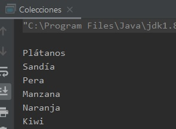

## Reto 03: Collections

### OBJETIVO 

- Aprender a usar la clase **java.util.Collections** para búsquedas y ordenamientos de elementos dentro de una Lista.

#### REQUISITOS 

1. Tener instalada la última versión del JDK 8.
2. Tener instalada la última versión de IntelliJ IDEA Community.

#### DESARROLLO

En este reto usarás la clase **Collections** para realizar búsquedas y ordenamientos en una lista de cadenas.

- Revisa la documentación de la clase Collections (https://docs.oracle.com/javase/8/docs/api/?java/util/Collections.html), de esta forma tendrás una ídea de los métodos que podrías usar para llevar a cabo el reto.
- Crea una lista de cadenas llamada **listaFrutas** y llénala con los siguientes elementos:
	- Plátanos
	- Sandía
	- Pera
	- Manzana
	- Naranja
	- Kiwi
	
- Voltea el órden de los elementos de la colección. Esto quiere decir que el `Kiwi` deberá ser el primer elemento en la lista y los `Plátanos` los últimos.
- Búsca cuál es el elemento más pequeño, o sea, si los ordenáramos alfabéticamente ¿cuál sería el primer elemento en la lista?
- Búsca cuál es el elemento más grande, o sea, si los ordenáramos alfabéticamente ¿cuál sería el último elemento en la lista?
- Ordena la lista alfabéticamente.
- Busca en qué posición de la lista, ya ordenada, están la `Pera` y la `Naranja`.
- Agrega tres `Manzana`s nuevas a la lista.
- Desordena los elementos de la lista, es decir, órdenalos de manera aleatoria en la lista.
- Busca cuántas `Manzana`s hay en la lista.

	
Solución

	

 

