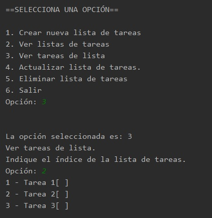
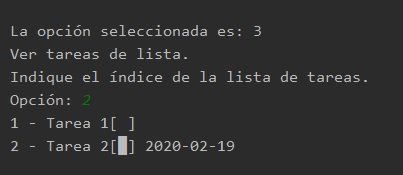

## Postwork 07: Opciones de Tareas

### OBJETIVO

- Mejorar el proyecto para trabajar con Tareas individuales, además de las listas de tareas ya existentes.

#### REQUISITOS

1.  El avance del postwork de la sesión 06.

#### DESARROLLO

En este postwork crearás un nuevo menú de opciones para manejar las tareas dentro de las listas. Este menú permitirá seleccionar las opciones para agregar nuevas tareas, eliminar tareas existenes y marcar tareas como realizadas.

También crearas una clase especializada para realizar las operaciones anteriores.

Para finalizar, modificarás algunas de las clases existentes para colocar estas nuevas funcionalidades.

<details>
        <summary>Solución</summary>
        
1. En la clase **Menu** agrega un nuevo método llamado **muestraOpcionesTarea**, el cual desplegará la lista de opciones que tenemos para manejar las tareas dentro de una `ListaTareas`. Coloca las siguientes opciones:
```java
    public void muestraOpcionesTarea() {
        System.out.println("\n==SELECCIONA UNA OPCIÓN==\n");
        System.out.println("1. Agregar nueva tarea");
        System.out.println("2. Eliminar tarea");
        System.out.println("3. Marcar tarea como realizada");
        System.out.println("4. Regresar");
    }
```

2. Crea una nueva clase llamada **ManejadorTareas**, que nos ayudará a realizar las acciones mencionadas en el menú anterior. Esta clase tendrá tres métodos que implementaremos a continuación:

```java
public class ManejadorTareas {

    public Tarea nuevaTarea() {

    }

    public Tarea eliminaTarea(ListaTareas listaTareas) {

    }

    public Tarea marcarTareaFinalizada(ListaTareas listaTareas) {

    }
}
```

3. Como esta clase necesitará interacción por parte del usuario para proporcionar información referente a las tareas, agregaremos una instancia de la clase **Lector**:
```java
    private final Lector lector = new Lector();
```

4. Ahora, implementaremos el método **nuevaTarea**. En este método pediremos al usuario que coloque la información de la nueva tarea. En este momento sólo será el nombre y en la siguiente sesión la modifcaremos para dolicitar también una fecha de expiración. Capturaremos el nombre de la tarea usando al isntancia de **Lector**:
```java
        System.out.println("Nueva Tarea");
        System.out.println("Introduce los datos de la nueva tarea: ");
        System.out.println("Nombre:");
        String nombreTarea = lector.leeCadena();
```

5. Una vez que ya tenemos el nombre de la tarea, simplemente regresamos una nueva instancia de la misma. Más adelante colocaremos esta instancia en una lista de tareas:
```java
        return new Tarea(nombreTarea);
```

6. Ahora implementaremos el método **eliminaTarea**. Este método recibe como parémetro la `ListaTareas` de la que se eliminará. Lo primero que haremos será pedir el índice de la tarea a eliminar:
```java
        System.out.println("Eliminar tarea");

        System.out.println("Indica el índice de la tarea a eliminar");
        byte indice = lector.leeOpcion();
```

7. Después, validaremos que dicho índice no exceda el número de tareas que tiene esa lista de tareas, de forma similar a lo que hicimos en la sesión anterior:
```java
        if (indice > listaTareas.numeroTareas()) {
            System.out.println("La tarea indicada no existe.");
            return null;
        }

```
8. Al terminar, eliminamos la tarea de la lista usando el método **eliminaTarea** de la instancia de **listaTareas** que el método recibe como parámetro. Recuerda que para convertir el índice introducido por el usuario al índide de la lista, debemos restarle ***1*** al primero:
```java
        return listaTareas.eliminaTarea(indice - 1);
``` 

9. Para terminar con esta clase, implementaremos el método **marcarTareaFinalizada**. Aquí haremos algo similar a lo que hicimos en el método anterior: primero pediremos el índice de la tarea que se marcará coomo finalizada, y después validamos que el índice del usuario no exceda el número de elementos en la lista:
```java
        System.out.println("Finalizar tarea");

        System.out.println("Indica el índice de la tarea a marcar");
        byte indice = lector.leeOpcion();

        if (indice > listaTareas.numeroTareas()) {
            System.out.println("La tarea indicada no existe.");
            return null;
        }
```

10. Una vez que hemos hecho esta validación, obtenemos la tarea indicada por el usaurio, colocamos la fecha de finalización como el momento actual, y colocamos el valor de su atributo **realizada** como **true**:
```java
        Tarea tarea = listaTareas.getTareas().get(indice - 1);
        tarea.setFechaRealizacion(LocalDate.now());
        tarea.setRealizada(true);

        return tarea;
```

11. Ahora realizaremos algunas modificaciones en la clase **ListasTareas**. Lo primero que haremos será colocar una nueva instancia de la clase **Menu**, que nos ayudará a mostrar el menú para el manejo de las tareas. También, colocamos una nueva instancia de la clase **ManejadorTareas** que creamos hace un momento:
```java
    private Menu menu = new Menu();
    private ManejadorTareas tareas = new ManejadorTareas();
```

12. Lo siguiente es completar el método **actualizarListaDeTareas**, que en la sesión anterior quedó en la parte de capturar y validar el índice de la lista de tareas introducido por el usuario. Lo que haremos ahora será obtener la instancia de **ListaTareas** que se encuentra en el índice proprocionado:
```java
        ListaTareas listaActual = listasTareas.get(indice - 1);
```

13. El siguiente paso es mostrar al usuario la lista de opciones para el manejo de tareas, y capturar la opción seleccionada:
```java
        menu.muestraOpcionesTarea();
        byte opcionSeleccionada = lector.leeOpcion();
```

14. Ahora, colocamos un **switch** para manejar la opción que el usuario haya seleccionado:
```java
        switch (opcionSeleccionada){
        }
``` 

15. Para el primer caso, la opción 1, lo que haremos será llamar al método **nuevaTarea** de la instancia de **ManejadorTareas** y guardar la tarea regresada como resultado de la invocación de dicho método, en la lista de tareas seleccionada por el usuario:
```java
        case 1:
                Tarea nuevaTarea = tareas.nuevaTarea();
                listaActual.agregaTarea(nuevaTarea);
                break;
```

16. Para el segundo caso, eliminar una tarea de la lista, usamos el método **eliminaTarea** de **ManejadorTareas** y le pasamos la lista seleccionada por el usuario. Si la instancia que regresa es nula, indicamos que no se pudo eliminar la tarea, si tiene un valor, mostramos un mensaje indicando que la tarea se eliminó:
```java
        case 2:
                Tarea t1 = tareas.eliminaTarea(listaActual);
                if(t1 != null) {
                    System.out.println("Se eliminó la tarea " + t1.getNombre());
                }
                else {
                    System.out.println("No se pudo eliminar la tarea.");
                }
                break;
```

17. Para la tercera opción, marcar una tarea como finalizada, hacemos algo similar. Usamos el método **marcarTareaFinalizada** de **ManejadorTareas** pasándola la lista de tareas como parámetro. Si regresa un valor indicamos que la tarea se marco como finalizada, si regresa nulo indicamos que la tarea no pudo ser marcada:
```java
        case 3:
                Tarea t2 = tareas.marcarTareaFinalizada(listaActual);
                if(t2 != null) {
                    System.out.println("La tarea " + t2.getNombre() + " se completó el " + t2.getFechaRealizacion());
                }else{
                    System.out.println("La tarea no pudo ser marcada como finalizada.");
                }
                break;
```

18. Para la cuarta opción, regresar, simplemente no hacemos nada. Colocamos una instrucción **break** con lo que lograremos que el programa continúe su ejecución y regrese al paso anterior:
```java
            case 4:
                break;
```
19. Colocamos una opción **default** que manejará cualquier otro valor mostrando un mensaje al usuario que la opción seleccionada no es válida. 
```java
            default:
                System.out.println("Opción desconocida.");
```

20. Para terminar con el postwork. Ahora que ya podemos marcar tareas como finalizadas, modificaremos la forma en la que se muestran las tareas dentro de una lista. En la clase **ListaTareas**, dentro del método **muestraTareas** hay un ciclo que muestra todas las tareas de la lista. Dentro del cilo, modificaremos el contenido por el siguiente:
```java
        Tarea tarea = tareas.get(i);
        System.out.println((i + 1) + " - " + tarea.getNombre() + "[" + (tarea.isRealizada() ? "█" : " ")  + "] " + (tarea.isRealizada() ? tarea.getFechaRealizacion() : ""));
```

esto hará que las tareas que están finalizadas aparezcan con un cuadro relleno y la fecha de finalización, mientras que las tareas no terminadas aparecerán con un cuadro vacío.

21. Ejecuta la aplicación, agregando y eliminando tareas para que veas que todo funciona de forma correcta:






</details>


